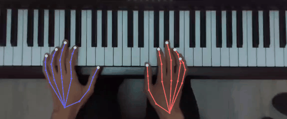
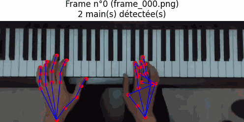

## Overview

This project explores 2D hand pose estimation applied to piano playing. Starting from a top-down video of a pianist's hands, the goal is to track 21 keypoints per hand, follow them over time, and extract kinematic information such as fingertip trajectories and speeds.

The project was first built with [MMPose](https://github.com/open-mmlab/mmpose) (HRNetv2-W18 trained on COCO-WholeBody hands) combined with [MediaPipe](https://ai.google.dev/edge/mediapipe/solutions/vision/hand_landmarker) for hand detection. That version no longer runs reliably, mainly because of its dependency chain. The pipeline has since been **rewritten around MediaPipe alone**, with a cleaner structure, several bug fixes, temporal filtering, and a quantitative quality report. The MMPose pipeline depended on a combination of packages: **mmcv-lite**, **mmdet** without dependencies and MMPose v1.3.2 cloned from source.

Two notebooks are provided:

| Notebook | Status | Description |
|---|---|---|
| **Projet_MMPose.ipynb** | Archived | Original MMPose + MediaPipe experiments |
| **Projet_MediaPipe.ipynb** | Current | Rewritten pipeline, easy to install and run |

## Topics

- 2D hand pose estimation (21 keypoints per hand)
- Top-down pose estimation and the role of bounding boxes
- Hand detection and tracking with MediaPipe
- Left/right hand identification across frames
- Temporal filtering: outlier rejection, gap interpolation, Savitzky–Golay smoothing
- Fingertip trajectories and speed analysis
- Quality evaluation: detection rate and jitter

## Original Project

The initial dataset was small and deliberately controlled: three photographs and one video of a right hand in a resting piano position, filmed from directly above (back of the hand facing the camera, fingers pointing up). The video shows a C major scale played up and down.

The work progressed step by step:

1. **Neutral background.** A hand centered on a white background is handled without difficulty by the pose model.
2. **Piano background.** The same hand resting on a keyboard is poorly detected.
3. **Understanding the failure.** MMPose is a top-down model: it expects a bounding box around each hand. Passing the full image as the bounding box tells the model that the hand fills the frame, which is false when the hand occupies a small part of a piano scene. Cropping the image around the hand fixed the problem.
4. **Automating the crop.** MediaPipe detects the hands, a margin is added around each detection, the crop is passed to MMPose, and the predicted coordinates are mapped back to the original frame using the crop offsets.
5. **Extension to the left hand, spread fingers, two static hands, and a two-hand video** with a larger range of motion, exported as an annotated GIF.

On the C major scale, the extracted trajectories and speeds matched what happens physically:

- Trajectories are cyclic, as expected when the hand returns to its starting position after the ascending and descending scale.
- Keypoints remain relatively still except during two events: the E→F transition going up and the F→E transition going down, which correspond to the thumb passing under the hand.
- On the way up, the thumb keypoints start accelerating slightly before the others; on the way down, the same is observed for the middle finger.

## The New Notebook

**Projet_MediaPipe.ipynb** keeps the same goal and the same 21-keypoint hand topology, but is built on a single library: **mediapipe**.

Reviewing the code also revealed several weaknesses that were independent of the installation problem:

- The speed computation derived the time step from a loop counter that did not hold the extraction step, so the speeds were scaled incorrectly.
- Duplicate points were removed before computing speeds, but the time axis was rebuilt as if samples were evenly spaced, which distorted time.
- Frames were sampled every 10th image of a 59 fps video (about 6 frames per second), which is not enough for finger movements.
- Left and right hands were told apart by sorting bounding boxes by x-position, which fails when the hands cross.
- The code crashed whenever fewer than two hands were detected in a frame.
- Crop margins were fixed in pixels rather than relative to the hand size.
- Per-keypoint confidence scores were computed but never used.
- There was no quantitative evaluation, only visual inspection.

### Pipeline

1. **Detection and tracking.** MediaPipe's hand landmarker runs in **VIDEO** mode, so hands are tracked from frame to frame instead of being re-detected independently
2. **Left/right assignment.** Wrist positions are matched between consecutive frames with the Hungarian algorithm, which keeps identities consistent even when one hand crosses the other. Duplicate detections of the same hand are merged
3. **Cleaning.** Points that deviate too far from their local median are rejected, short gaps are linearly interpolated, and longer gaps are left empty rather than filled with invented data
4. **Smoothing.** A Savitzky–Golay filter is applied to each continuous segment, never across a gap
5. **Kinematics.** Trajectories and speeds are computed from the real frame timestamps and normalized by hand size
6. **Outputs.** Annotated MP4 and GIF, a CSV, and a quality report

### Outputs

- **output/mains_annotees.mp4** and **output/mains_annotees.gif**: video with the skeletons overlaid (left hand in blue, right hand in orange).
- **output/keypoints.csv**: one row per frame, hand and keypoint, with raw and smoothed coordinates and speed.
- A quality report table (per hand): raw detection rate, detection rate after interpolation, mean MediaPipe score, and jitter before and after smoothing.

## Results
With MMpose :

With MediaPipe :

MediaPipe

## Limitations

- The analysis is 2D. From a top-down camera, depth, and therefore actual key presses, is ambiguous
- The dataset is very small: one video of a scale, one performer, one camera angle
- No ground-truth annotations exist yet, so accuracy is assessed through detection rate and jitter rather than a keypoint error metric
- The MediaPipe and MMPose pipelines have not been benchmarked against each other on the same footage
- MediaPipe's landmark model cannot easily be fine-tuned on custom data

## Other contributors
<table>
  <tr>
    <td align="center">
      <a href="https://github.com/s-fraresso">
         
        <b>Sylvain Fraresso</b>
      </a>
    </td>
    <td align="center">
      <a href="https://github.com/fanzelda">
         
        <b>Gaël Jean-Albert</b>
      </a>
    </td>
    <td align="center">
      <a href="https://github.com/JPYasashii">
         
        <b>Titouan Martineau</b>
      </a>
    </td>
  </tr>
</table>