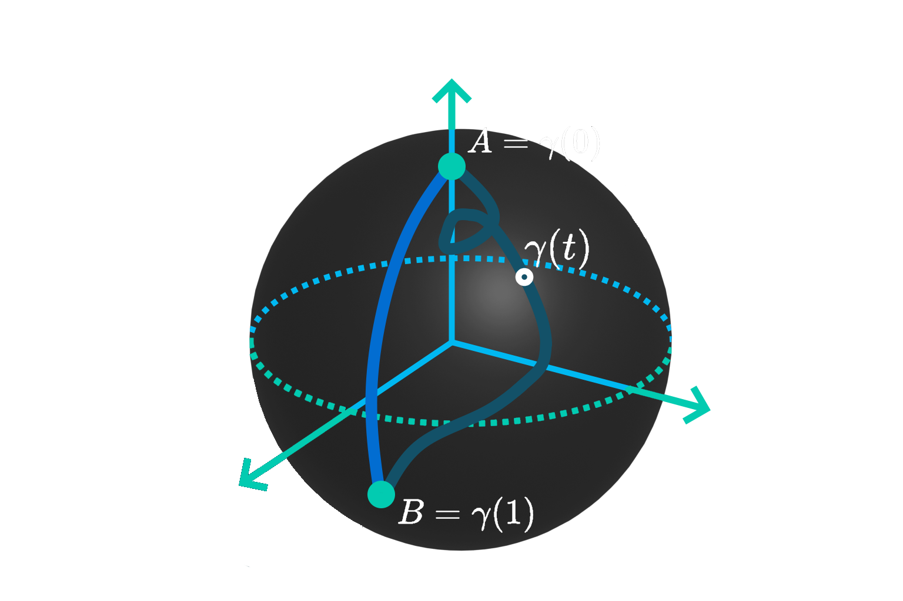

## Overview

This project formalizes the intuitive notions of curve and length in order to prove, as rigorously as possible, a number of results on the length of curves in $\mathbb{R}^n$. It focuses on the methods of infinitesimal calculus developed since the 17th century, and shows how they apply to concrete computations and optimization problems.

The project was carried out as a team of four students and concludes with a study of the ellipse and of geodesics, the generalization of straight lines to curved spaces.

The project was carried out as a team under the supervision of Patrice Lassère, from the [Institut de Mathématiques de Toulouse](https://www.math.univ-toulouse.fr/fr/)

## Topics

- Parametrized arcs, simple arcs and Jordan curves
- Regular arcs ($C^1$ curves)
- Length of a curve as a supremum over polygonal approximations
- Rectifiable curves and additivity (Chasles relation)
- Length formula $L(\gamma) = \int_a^b \|f'(t)\|\,dt$ (Cartesian, graph and polar forms)
- Geometric arcs and reparametrization invariance
- Counter-examples: limits of curves and non-rectifiable curves
- Beta and Gamma functions
- Elliptic integrals and perimeter of an ellipse
- Geodesics in metric spaces
- Great-circle routes (orthodromic vs loxodromic paths)

## Length of a Curve

The length of a parametrized arc is defined as the supremum of the lengths of inscribed polygonal curves. The project shows that arcs with bounded derivative are rectifiable, and that for regular arcs this length is given by the integral of the norm of the velocity vector.

The notion of geometric arc, defined through $C^k$-equivalence, justifies that the length does not depend on the chosen parametrization.

## Pitfalls and Examples

A dedicated section highlights the limits of intuition: a sequence of curves of constant length can converge to a curve of different length (a square "converging" to its inscribed circle), and some simple continuous curves, such as $t \mapsto (t, t^2 \sin(1/t^2))$, are not rectifiable.

The formulas are then applied to classical curves (astroid, cardioid, logarithmic spiral, sinusoid), and to optimization problems involving parabolas, one of which defies the first intuition.

## The Ellipse

The perimeter of an ellipse is expressed as a complete elliptic integral of the second kind, which has no closed form in terms of elementary functions. It is applied to the orbit of the Earth around the Sun, giving a length of about 940 million km, very close to a circle given the tiny eccentricity.

The project also proves that, among all ellipses of a given area, the disc has the minimal perimeter.

## Geodesics

The project proves that the shortest path between two points of $\mathbb{R}^d$ is the straight line, and discusses how uniqueness fails with other distances such as the Manhattan distance. Geodesics are then introduced in metric spaces, and the shortest path on a sphere is shown to follow a great circle, which explains the curved trajectories of flights on a flat map.

The reverse question is also addressed: for paths whose coordinates are all monotone, the length is bounded by the sum of the coordinate variations, and the project compares the lengths of graphs of convex functions.

## Other contributors
<table>
  <tr>
    <td align="center">
      <a href="https://github.com/s-fraresso">
         
        <b>Sylvain Fraresso</b>
      </a>
    </td>
    <td align="center">
      <a href="https://github.com/fanzelda">
         
        <b>Gaël Jean-Albert</b>
      </a>
    </td>
    <td align="center">
      <a href="https://github.com/JPYasashii">
         
        <b>Titouan Martineau</b>
      </a>
    </td>
  </tr>
</table>