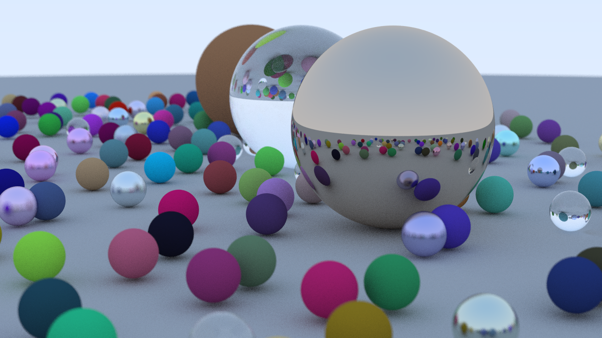

## Overview

This project is a path tracer written from scratch, based on Peter Shirley's book series 
- [Ray Tracing in One Weekend](https://raytracing.github.io/books/RayTracingInOneWeekend.html)
- [Ray Tracing: The Next Week](https://raytracing.github.io/books/RayTracingTheNextWeek.html)
- [Ray Tracing: The Rest of Your Life](https://raytracing.github.io/books/RayTracingTheRestOfYourLife.html)

It covers the core principles of physically based rendering, from basic ray-sphere intersection to Monte Carlo integration and importance sampling.

Beyond following the books, the original code has been modernized and restructured: it is now organized into modules, parallelized with multithreading and documented. The project is still evolving, and further improvements are planned.

## Topics

- Ray generation and camera model (field of view, depth of field)
- Ray-object intersection (spheres, quads, volumes)
- Materials: diffuse, metal, dielectric and emissive
- Antialiasing and gamma correction
- Bounding Volume Hierarchy (BVH)
- Textures (solid, procedural, image-based, Perlin noise)
- Instancing (translation, rotation)
- Participating media (fog, smoke)
- Monte Carlo integration
- Importance sampling and probability density functions (PDF)

## Rendering Pipeline

The renderer follows the path tracing approach: for each pixel, rays are cast through the scene and bounce on surfaces according to their material, accumulating color and light along the way. Averaging many samples per pixel reduces noise and produces smooth antialiased results.

Scenes are described as collections of hittable objects, accelerated by a Bounding Volume Hierarchy that reduces the number of intersection tests per ray from linear to logarithmic in the number of objects.

## Lighting and Sampling

The last part of the series focuses on the mathematics behind realistic lighting. Monte Carlo integration is used to estimate the rendering equation, and importance sampling (towards light sources and according to material scattering PDFs) drastically reduces noise for the same number of samples.

## Modernization

Compared to the original books, the codebase has been reworked with:
- A modular architecture, separating geometry, materials, textures and rendering logic
- Multithreaded rendering to take advantage of multi-core CPUs
- Documentation of the code and its main components

Further improvements are planned, such as :
- Normal Mapping
- Surface Area Heuristic
- Open Image Denoise